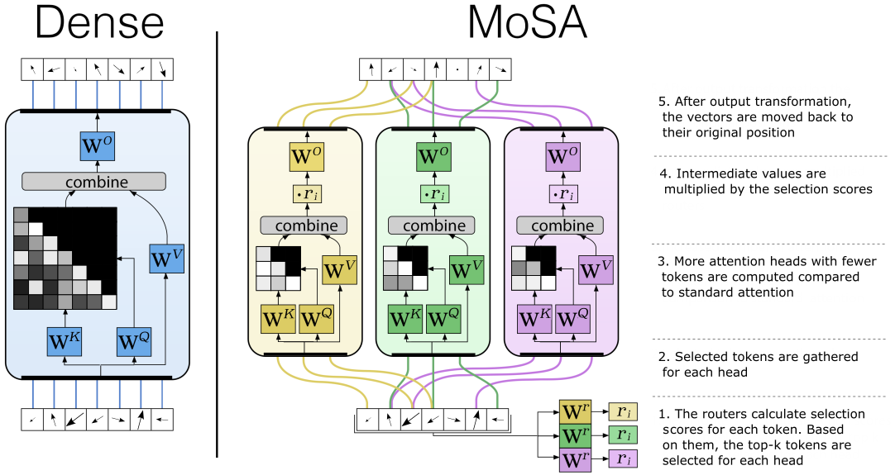

# Mixture of Sparse Attention (MoSA) repository

Paper: https://arxiv.org/abs/2505.00315



User-friendly implementation of the Mixture-of-Sparse-Attention (MoSA). MoSA selects distinct tokens for each head with expert choice routing providing a content-based sparse attention mechanism.

# Example usage

```python
import torch
from mosa import MoSA
batch_size, sequence_length, h = 32, 512, 128
sparsity = 16
h_prim = 16
num_mosa_heads = 4
hybrid_type = 'dense'
 # can be either 'dense' or 'local'. In order to use 'local' install local-attention package
num_other_heads = 3 

x = torch.rand(batch_size, sequence_length, h)
mosa_head = MoSA(h, h_prim, num_mosa_heads, num_other_heads, sequence_length, sparsity, hybrid_type)
mosa_head(x).shape
```
This creates a hybrid of MoSA with either a dense head or a [local-attention](https://github.com/lucidrains/local-attention/tree/master) (make sure to install local-attention package if you use it). 

In order to use just MoSA (for example for a custom attention layer), use `mosa.PureMoSA`

# Interface

`mosa.PureMoSA` - multihead implementation of MoSA:
  - `h: int` - size of the hidden dimension of the model
  - `h_prim: int` - size of the hidden dimension inside each head
  - `num_mosa_heads: int` - number of MoSA heads
  - `max_seq_len: int` - maximum sequence length during training, used to derive number of tokens for the local-attention, when using `hybrid_type='local'`
  - `sparsity: int` - sparsity of the attention, the model takes `seq_len/sparsity` tokens for the attention
  - `include_first: bool = False` - whether to include first token in the MoSA attention heads regardless of the router scores 
  - `rotate_fraction: float = 0.5` - percentage of dimensions to rotate in RoPE
  - `rope_base: int = 10000` - base of the exponent for the rope encodings

`mosa.MoSA` - hybrid of PureMoSA with either dense attention or local attention.
Uses the same arguments as PureMoSA with additional specifications for the hybrid:
  - `num_other_heads: int` - number of dense/local heads (type of other head specified in `hybrid_type`)
  - `hybrid_type: 'dense'|'local' = 'dense'` - whether to combine MoSA with dense heads(`dense`) or local attention (`local`)

# Installation

MoSA code relies only on `pytorch`. In order to use hybrid with local attention install [`local-attention`](https://github.com/lucidrains/local-attention/tree/master) 

